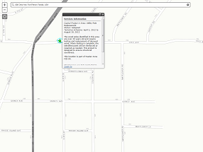

# information-lookup

Web app template that is used to determine if the location specified intersects a polygon.  The location entered is optionally stored in a layer in the web map.

## Features
* Place Finding - Find places or geocode an address
* Graphics - Draw a point
* Query - Determine if drawn graphic is within a specific area
* Webmap- Use the template with ArcGIS Online webmaps 

## Instructions

1. Fork and then clone the repo. 
2. Update the configuration settings to use template
2. Run and try the samples.

## Requirements

* Notepad or your favorite HTML editor
* Web browser with access to the Internet

## Deploying

1. To deploy this application, download the template from Portal/ArcGIS Online and unzip it.
2. Copy the unzipped folder containing the web app template files, such as index.html, to your web server. You can rename the folder to change the URL through which users will access the application. By default the URL to the app will be `http://<Your Web Server>/<app folder name>/index.html`
3. Change the sharing host, found in defaults.js inside the config folder for the application, to the sharing URL for ArcGIS Online or Portal. For ArcGIS Online users, keep the default value of www.arcgis.com or specify the name of your organization.
  - ArcGIS Online Example:  `"sharinghost": location.protocol + "//" + “<your organization name>.maps.arcgis.com`
  - Portal Example where `arcgis` is the name of the Web Adaptor: `"sharinghost": location.protocol + "//" + "webadaptor.domain.com/arcgis"`
4. If you are using Portal or a local install of the ArcGIS API for JavaScript, change all references to the ArcGIS API for JavaScript in index.html to refer to your local copy of the API. Search for the references containing `"//js.arcgis.com/3.13"` and replace this portion of the reference with the url to your local install.
  - For example: `"//webadaptor.domain.com/arcgis/jsapi/jsapi"` where `arcgis` is the name of your Web Adaptor.
5. Copy a map or group ID from Portal/ArcGIS Online and replace the default web map ID in the application’s index.html page. You can now run the application on your web server or customize the application further.

> **Note:** If your application edits features in a feature service, contains secure services or web maps that aren't shared publicly, or generate requests that exceed 200 characters, you may need to set up and use a proxy page. Common situations where you may exceed the URL length are using complex polygons as input to a task or specifying a spatial reference using well-known text (WKT). For details on installing and configuring a proxy page see [Using the proxy](https://developers.arcgis.com/javascript/jshelp/ags_proxy.html). If you do not have an Internet connection, you will need to access and deploy the ArcGIS API for JavaScript documentation from [developers.arcgis.com](https://developers.arcgis.com/).

## Resources

* [ArcGIS for JavaScript API Resource Center](http://help.arcgis.com/en/webapi/javascript/arcgis/index.html)
* [ArcGIS Blog](http://blogs.esri.com/esri/arcgis/)
* [twitter@esri](http://twitter.com/esri)

## Issues

Find a bug or want to request a new feature?  Please let us know by submitting an issue.

## Contributing

Esri welcomes contributions from anyone and everyone. Please see our [guidelines for contributing](https://github.com/esri/contributing).

## Licensing
Copyright 2013 Esri

Licensed under the Apache License, Version 2.0 (the "License");
you may not use this file except in compliance with the License.
You may obtain a copy of the License at

   http://www.apache.org/licenses/LICENSE-2.0

Unless required by applicable law or agreed to in writing, software
distributed under the License is distributed on an "AS IS" BASIS,
WITHOUT WARRANTIES OR CONDITIONS OF ANY KIND, either express or implied.
See the License for the specific language governing permissions and
limitations under the License.

A copy of the license is available in the repository's [license.txt](https://github.com/esri/information-lookup/blob/master/License.txt) file.

​
